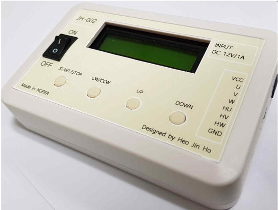

# bldc 모터 컨트롤러

ATMEGA128과 3상 인버터를 활용하여 BLDC모터를 제어하였습니다. 전류 검출과 부드스트랩회로를 사용하였고 게이트 드라이버 ic를 활용하여 3상인버터를 구성하였습니다. 전체적인 동작은 모터의 속도를 증가, 감소, 시작/정리, 정/역방향으로 설정할 있습니다.

MCU : ATMEGA128A

게이트 드라이브 IC : IR2101

FET : KF5N50

수행기간 : 2022.02.01.~2022.03.30

# 제작한 bldc 모터 컨트롤러

# bldc 모터 컨트롤러 동작 영상

https://youtu.be/dvKtNP3jzVg

# 세부사항 및 포트폴리오

## 동작원리

1. 제품에 전원이 들어온 상태에서 모터가 연결 되면 ATmega128A가 모터의 현재 홀센서 위치를 읽어 검출하여 여기에 맞도록 6개의 MOSFET소자를 구동하기 위한 게이트 드라이브 신호를 출력 합니다.

2. 이 때 필수적으로 상위 MOSFET 소자를 구동하는 부트스트랩 회로의 커패시터를 충전시켜 주어야 합니다. 그렇지 않을 경우 상위 MOSFET의 게이트 전압이 부족하여 MOSFET이 구동하지 않을 수 있습니다. 본 제품의 경우 PWM신호의 DUTY 비가 15%에서 시작하여 커패시터가 충전될 시간이 충분하니 신경 쓰지 않아도 됩니다.

3. PWM신호와 인터럽트를 사용하기 위해 IR2101의 HIN 핀에 ATMEGA128A의 OCR1A, OCR1B, OCR1C 핀에 각각 연결하여 타이머를 사용합니다. 홀센서의 위치에 맞는 신호들을 HIN,LIN에 넣어 타이머로 인터럽트를 하여 각 스텝을 바꿉니다. 총 6스텝이 한바퀴입니다.

4. 스위치를 누름에 따라 DUTY가 5%씩 상승하고 감소하여 모터의 속도가 증감합니다. 그리고 모터를 정지할 경우 DUTY가 0%가 되고 START를 누를시 처음에 15%의 DUTY가 나타납니다.  DUTY는 15~95%까지 조절 가능합니다.

5. 하부 MOSFET에 1Ω의 와트 저항을 사용하여 ATMEGA128D의 ADC로 값을 읽어 800mA 이상의 전류가 측정되면 모터를 정지하여 모터 과부하를 막습니다. 추가적으로 ADC로 값을 입력받을 때 LPF를 달아서 안정적으로 입력 값을 받습니다.

## 결과

1.션트 저항 1옴으로 인한 전력손실

-> 1옴의 션트저항을 사용해 전류 노이즈에 민감하지 않은 대신 전력 손실 문제가 발생합니다.

-> 차동증폭기를 이용하여 값을 증폭시키고 차동증폭기의 특성인 공통모드노이즈 제거로 노이즈 개선 효과를 얻을 수 있습니다.

-> 제품 설계 단계에서 회로 동작에 중점을 두어 차동증폭기를 고려하지 못했습니다. 그리고 6-스텝 제어이기 때문에 단상의 전류센싱으로 충분하지만 3상의 전류 센싱을 한다면 슛스루 현상을 감지할 수 있습니다.   

2.외부인터럽트와 타이머 인터럽트 

-> 타이머 인터럽트를 이용하여 6스텝 제어를 하였을 때는 모터의 회전 주기에 맞게 인터럽트가 동작하지 않아 과전류가 빈번하게 발생하였습니다.

-> 홀센서를 외부 인터럽트로 사용하여 이벤트가 발생할 때 마다 인터럽트가 발생하게 끔 수정하여 과전류 문제를 해결하였습니다.

3.모터 주파수 결정 과정

-> 모터의 진동과 소음을 줄이기 위해서는 주파수를 가청주파수 이상의 20kHz이상 인가해야 합니다. 그러나 해당 모터는 최대 6200RPM을 만족하는 310Hz이기 때문에 어떻게 구현되어야 하는지 고민이 많았습니다. 

-> 먼저 PWM 주파수를 매우 작게 설정하니 모터가 회전하지 않고 진동만 하였습니다. 반면에 20kHz 이상을 인가해보니 소음과 진동이 줄어들고 회전이 되었습니다. 

-> BLDC모터의 내부 구조와 원리를 파악한 결과 AC모터와는 달리 전원 주파수의 변화로 인한 속도 제어가 아닌 고정자에 전압이 얼마나 인가 되었는지에 따라 회전속도가 정해진다는 사실을 알게되었습니다. 그리고 PWM 주파수가 모터의 초당 회전수보다 훨씬 커야 모터의 회전자가 반응할 시간이 충분해 안정적으로 회전할 수 있다는 사실과 BLDC는 브러시가 없어 크게 상관없지만, DC 모터의 경우 주파수 상승으로 주기가 짧아져 전류가 상승할 시간이 줄어드는 효과로 전류 리플이 작아진다는 사실을 알게 되었습니다. 이를 통해 PWM 주파수를 20kHz로 인가하여 모터를 동작시켰습니다.

## BOM

## 원가 분석표

